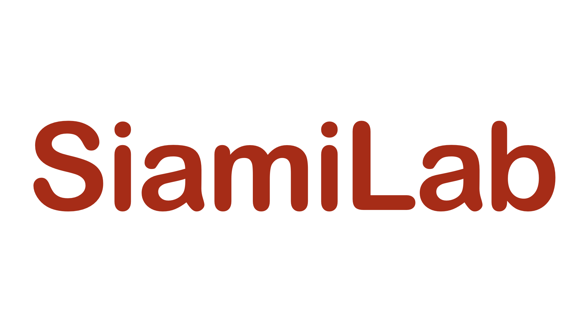
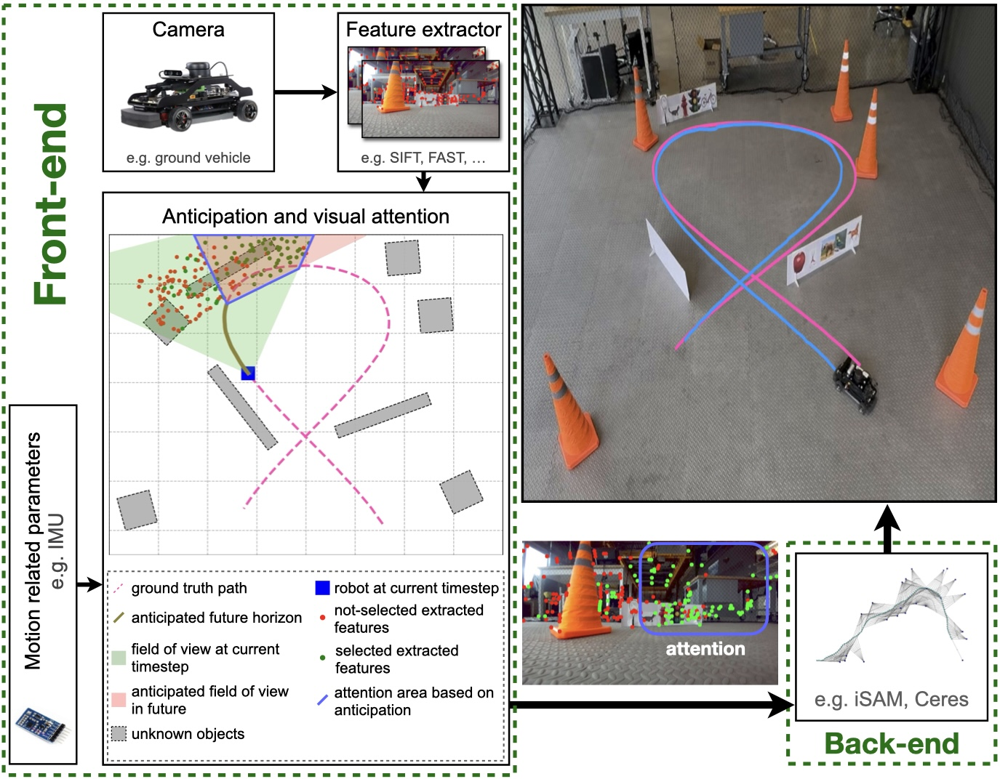
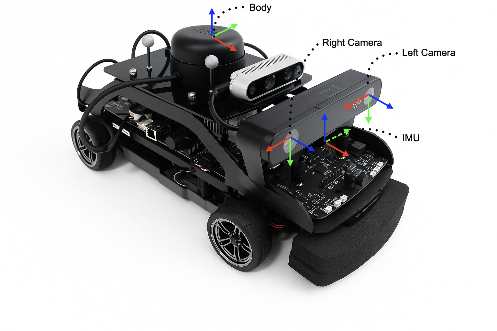

<div align="center">
  <a href="https://siami.sites.northeastern.edu/">
    
  </a> 
  <a href="https://www.northeastern.edu/">
    
  </a> 
  <a href="https://mit.edu"> 
    
  </a>
</div>

<br><br>

# Non-submodular Visual Attention for Robot Navigation

**Authors:** [Reza Vafaee](https://www.linkedin.com/in/rezavafaee/), [Kian Behzad](https://www.linkedin.com/in/kianbehzad/), [Milad Siami](https://coe.northeastern.edu/people/siami-milad/), [Luca Carlone](https://lucacarlone.mit.edu/), [Ali Jadbabaie](https://jadbabaie.mit.edu/)


This work builds upon the [VINS-Mono](https://github.com/HKUST-Aerial-Robotics/VINS-Mono) and [Anticipated VINS-Mono](https://github.com/plusk01/Anticipated-VINS-Mono) projects, introducing a task-oriented computational framework to enhance Visual-Inertial Navigation (VIN) for robots. It addresses key challenges such as limited time and energy resources by strategically selecting visual features based on a *Mean Square Error (MSE)-driven, non-submodular objective function* combined with a simplified dynamic anticipation model.

To tackle the NP-hard nature of this selection problem, we propose four polynomial-time approximation algorithms:

1. ***Classic Greedy Method*** – a baseline approach with proven effectiveness.
2. ***Low-Rank Greedy Variant*** – reduces computational complexity accuracy loss.
3. ***Randomized Greedy Sampler*** – balances efficiency and solution quality.
4. ***Linearization-Based Selector*** – employs a first-order Taylor expansion for near-constant-time execution.


<br>
<div align="center">
    
</div>
<br>

## Related Papers and Dataset
For detailed information on the methods and algorithms implemented in this work, please refer to our paper. If you use this work or the accompanying dataset in your research, kindly cite the relevant reference(s) below.

- R. Vafaee, K. Behzad, M. Siami, L. Carlone, A. Jadbabaie, **"Non-submodular Visual Attention for Robot Navigation"**. IEEE Transactions on Robotics, 2025. [arXiv](https://arxiv.org/abs/2510.00942).
 
  ```bibtex
  @article{Nonsubmodular_TRO,
    title = {Non-submodular Visual Attention for Robot Navigation},
    author = {Vafaee, Reza and Behzad, Kian and Siami, Milad and Carlone, Luca and Jadbabaie, Ali},
    year = {2025},
    journal = {IEEE Transactions on Robotics},
    pdf = {https://arxiv.org/abs/2510.00942}
  }
  ```
- K. Behzad, R. Vafaee, M. Siami, L. Carlone, A. Jadbabaie, **"Visual Inertial Navigation: Cancer-Ribbon Dataset"**, IEEE Dataport, 2025, doi: [10.21227/n36c-xz38](https://dx.doi.org/10.21227/n36c-xz38).

  ```bibtex
  @data{n36c-xz38-25,
    doi = {10.21227/n36c-xz38},
    url = {https://dx.doi.org/10.21227/n36c-xz38},
    author = {Kian Behzad and Reza Vafaee and Milad Siami and Luca Carlone and Ali Jadbabaie},
    publisher = {IEEE Dataport},
    title = {Visual Inertial Navigation: Cancer-Ribbon Dataset},
    year = {2025}
  }
  ```

## Demo

https://github.com/user-attachments/assets/24824066-578c-4ccd-8916-f38e7ff78d26


## Cancer-Ribbon Experiment

This framework is compatible with any EuRoC-formatted dataset played as a ROS bag. In our experiments, we used both the official EuRoC MAV datasets and a custom Cancer-Ribbon Experiment to evaluate our method.  

The Cancer-Ribbon dataset is provided in EuRoC format, available as both an **ASL dataset** and a **ROS bag**. It can be accessed from [IEEE DataPort](https://dx.doi.org/10.21227/n36c-xz38) *(link will be made publicly available upon paper acceptance)*.  

This dataset captures a [Quanser QCar](https://www.quanser.com/products/qcar/) ground vehicle equipped with a ZED2 stereo camera performing a cancer ribbon–shaped trajectory in 2D within a 6 × 6 m area. Ground truth is recorded using 8 Motive motion capture cameras mounted overhead.

For detailed information about the dataset, its files, and their structure, see the [dataset README](docs/dataset%20info/README.md).


<br>
<div align="center">
    
</div>


## Installation

You can install and run this project using either **Local Installation** or **Docker Installation**.  
For simplicity and ease of setup, we recommend the **Docker Installation** method described in this guide.


### Local Installation
To install and run this project locally, you must first set up the [VINS-Mono](https://github.com/HKUST-Aerial-Robotics/VINS-Mono) framework, which is built for **Ubuntu 16.04** and **ROS Kinetic**. Follow the [official ROS Kinetic installation guide](https://wiki.ros.org/kinetic/Installation/Ubuntu) after installing Ubuntu.

Once ROS is installed, source it in every terminal session:

```bash
# Source ROS Kinetic
$ source /opt/ros/kinetic/setup.bash  # if using bash
$ source /opt/ros/kinetic/setup.zsh   # if using zsh
```

To avoid repeating this step, add the appropriate line to the end of your `~/.bashrc` or `~/.zshrc` file.

Next, install **VINS-Mono** following its [README instructions](https://github.com/HKUST-Aerial-Robotics/VINS-Mono/blob/master/README.md). Ensure that VINS-Mono is running correctly before proceeding.

> **Note:** Even if you choose local installation, it’s worth reviewing the [Dockerfile](docker/Dockerfile). It can help you install all prerequisites correctly by showing the commands used in the Docker setup.

Create a new workspace and clone this repository:

```bash
# Create the workspace
$ mkdir -p visualattention_ws/src
$ cd visualattention_ws/src

# Clone the project
$ git clone https://github.com/SiamiLab/NonsubmodularVisualAttention.git
```

Build the workspace:

```bash
$ cd ..
$ catkin build
```

Finally, source the workspace in every terminal session:

```bash
# Source the workspace
$ source /PATH/TO/WORKSPACE/devel/setup.bash  # if using bash
$ source /PATH/TO/WORKSPACE/devel/setup.zsh   # if using zsh
```

As with ROS, you can add this line to your `~/.bashrc` or `~/.zshrc` for convenience.


### Docker Installation
You can use the provided [Dockerfile](docker/Dockerfile) to install and run the project, which automatically handles all prerequisites and dependencies. The Docker setup also enables display forwarding, allowing you to use visualization tools such as `rviz` directly from within the container.

To build the Docker image:

```bash
# Build the Docker image
$ docker build --rm -t nonsubmodular_visual_attention -f ./Dockerfile .
```

This creates an image named `nonsubmodular_visual_attention`.

Once built, you can create and run a container using the provided [docker_run.bash](docker/docker_run.bash) script.  
Before running the script, update the following line to replace `/home/siamilab/Euroc` with the appropriate path on your host machine. This mounts the host directory into `/root/Euroc` inside the container for easy data access in future.

```bash
--volume="/home/siamilab/Euroc:/root/Euroc:rw" \
```

Run the container:

```bash
# Create and start the container
$ sudo bash /PATH/TO/docker_run.bash
```

This launches a container named `nonsubmodular_visual_attention_container` from the `nonsubmodular_visual_attention` image and enables display forwarding for visualization tools.

> *Optional Note:* The container includes an SSH server with username and password `root`, mapping port `3333` on the host to port `22` in the container. This allows remote SSH access to the container `$ ssh root@<host-ip> -p 3333`

To stop the container:

```bash
$ docker stop nonsubmodular_visual_attention_container
```

To resume work, restart it using the provided [docker_resume.bash](docker/docker_resume.bash) script:

```bash
$ sudo bash /PATH/TO/docker_resume.bash
```


## Usage

### Download a ROS Bag Dataset
Download and extract any **EuRoC-formatted** dataset. You can use either:  
- [Official EuRoC MAV datasets](https://drive.google.com/open?id=1_kwqHojvBusHxilcclqXh6haxelhJW0O)  
- [Custom Cancer-Ribbon Experiment dataset](https://dx.doi.org/10.21227/n36c-xz38)  

> **Note for Docker users:** If using Docker, you can place the bag files directly into the mounted host directory and access them inside the container.

### Run VINS-Mono with Non-Submodular Visual Attention
After installation (either locally or via Docker), start the Non-Submodular Visual Attention pipeline by launching:

```bash
# Run the VIO pipeline
$ roslaunch vins_estimator euroc.launch sequence_name:=stereo_vio_exp_ccw_020_future_horizon_gt
```

- The `sequence_name` parameter specifies which ground truth dataset to use when `use_ground_truth_hgen` is enabled (see the **Parameters** section).  
- Alternatively, you can set this parameter directly in the [euroc.launch](vins_estimator/launch/euroc.launch) file and omit it from the command line.

Once the launch file is running, play the ROS bag:

```bash
# Play the Cancer-Ribbon Experiment bag file
$ rosbag play /path/to/bag/file.bag --clock
```

### Visualize in RViz
To view real-time visualizations, launch RViz:

```bash
# Launch RViz visualization
$ roslaunch vins_estimator vins_rviz.launch
```


## Parameters and Configurations
Below are the key configuration files and parameters used in this project.

### `euroc_config.yaml`
Located at [config/euroc/euroc_config.yaml](config/euroc/euroc_config.yaml).  

> **Note:** This configuration is set for the Cancer-Ribbon Experiment.  
> To use the official EuRoC MAV datasets, replace it with [config/euroc/euroc_config_original.yaml](config/euroc/euroc_config_original.yaml).

- *max_cnt* – Maximum number of features extracted from a frame before selection.  
- *use_feature_selector* – Enables/disables attention-based feature selection.  
- *max_features* – Maximum number of features to select from all available features per frame.  
- *use_ground_truth_hgen* – Specifies the future horizon generator:  
  - **1** – Use recorded ground truth as the future horizon.  
  - **0** – Use a predictive horizon generator based on the Bicycle model (only use for the Cancer-Ribbon Experiment):  

---

### `euroc.yaml`
Located at [feature_tracker/config/euroc.yaml](feature_tracker/config/euroc.yaml).  

Contains the intrinsic parameters of the camera used in the experiment.

> **Note:** This file is configured for the Cancer-Ribbon Experiment.  
> For official EuRoC MAV datasets, use [feature_tracker/config/euroc_original.yaml](feature_tracker/config/euroc_original.yaml).

---

### `parameters.h`
Located at [vins_estimator/src/parameters.h](vins_estimator/src/parameters.h).

- `FOCAL_LENGTH` – Focal length of the camera:  
  - **528.6** for the Cancer-Ribbon Experiment.  
  - **460** for official EuRoC MAV datasets.

---

### `state_defs.h`
Located at [vins_estimator/src/utility/state_defs.h](vins_estimator/src/utility/state_defs.h).

- `HORIZON` – Length of the future horizon, in number of frames.

---

### Selection Algorithms
Implemented in `feature_selection_methods.hpp`:

1. **Classic Greedy Method** – implemented in the `select_traceofinv_simple` function.
2. **Low-Rank Greedy Variant** – implemented in the `select_low_rank_update` function.
3. **Randomized Greedy Sampler** – implemented in the `select_traceofinv_randomized` function.
4. **Linearization-Based Selector** – implemented in the `select_linearized` function.

To switch between algorithms, edit [feature_selector.cpp](vins_estimator/src/feature_selector.cpp) and change the function used for feature selection.


## GPLv3 License

this work is open source under the [GPLv3](http://www.gnu.org/licenses/) license, see the [LICENSE](LICENSE) file.
